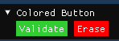

# Controls

## ColoredButton

The example displays a colored button.
Just provide the color in normal mode and the other colors will be automatically computed.



```
if (ColoredButton.Run(System.Drawing.Color.LimeGreen, "Validate"))
{
	// Button pressed
}
```
