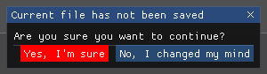

# Dialogs

## Open/Save File dialogs

The example triggers an Open file dialog:


First keep somewhere a reference to **FileDialogInfo**.

```
FileDialogInfo? _fileDialogInfo;
```

Then trigger the dialog by setting _fileDialogInfo and calling FileDialog.Run.

```
if (ImGui.Button("Trigger Open file dialog"))
{
    _fileDialogInfo = new()
    {
        Title = "Please select a file to open",
        Type = ImGuiFileDialogType.OpenFile,
        DirectoryPath = new DirectoryInfo(Directory.GetCurrentDirectory()),
        FileName = "",
        Extensions =
        [
            new Tuple<string, string>("*.txt", "Text files"),
            new Tuple<string, string>("*.*", "All files")
        ]
    };
    OpenFileDialogIsOpen = true;
}

if (OpenFileDialogIsOpen)
{
    if (FileDialog.Run(ref OpenFileDialogIsOpen, _fileDialogInfo))
    {
        _fileDialogResult = _fileDialogInfo.ResultPath;
    }
}
```

The path of the selected file will appear in **ResultPath**.

## Message dialog

This example asks the user to answer a question:



First keep somewhere a reference to **MessageDialog.Configuration**.
If different from null, the message box will appear. Set this configuration to null, to hide the dialog.

```
MessageDialog.Configuration? _messageDialogConfiguration;
```

Then in your loop check if a button if pressed. If yes shows the dialog by setting _messageDialogConfiguration and calling **MessageDialog.Run**.

```
if (ImGui.Button("Trigger a Message dialog"))
{
    _messageDialogConfiguration = new("Current file has not been saved",
        "Are you sure you want to continue?",
        [
            new MessageDialog.ButtonConfiguration(MessageDialog.ButtonId.Yes, "Yes, I'm sure",
                _ => YesPressed(),
                System.Drawing.Color.Red),
            new MessageDialog.ButtonConfiguration(MessageDialog.ButtonId.No, "No, I changed my mind",
                null
            )
        ]);
}

var result = MessageDialog.Run(_messageDialogConfiguration);
if (result != null)
{
    _messageDialogResult = result.Id.ToString();
    _messageDialogConfiguration = null;
}

ImGui.Text($"Result={_messageDialogResult}");

```

**_messageDialogResult.Id** indicates which button has been pressed.
