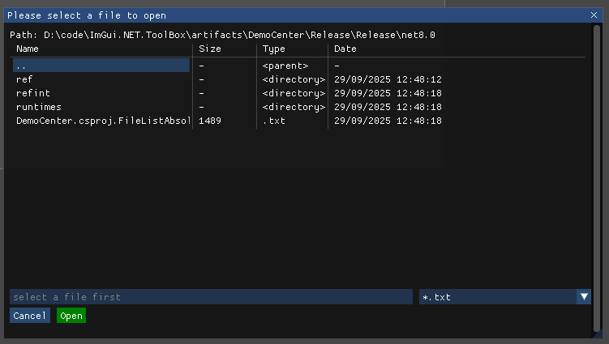

# Dialogs

## Open/Save File dialogs

The example triggers an Open file dialog:



First keep somewhere a reference to **FileDialogInfo**.

```
FileDialogInfo? _fileDialogInfo;
```

Then trigger the dialog.

```
if (ImGui.Button("Trigger Open file dialog"))
{
    _fileDialogInfo = new()
    {
        Title = "Please select a file to open",
        Type = ImGuiFileDialogType.OpenFile,
        DirectoryPath = new DirectoryInfo(Directory.GetCurrentDirectory()),
        FileName = "",
        Extensions =
        [
            new Tuple<string, string>("*.txt", "Text files"),
            new Tuple<string, string>("*.*", "All files")
        ]
    };
    OpenFileDialogIsOpen = true;
}

if (OpenFileDialogIsOpen)
{
    if (FileDialog.Run(ref OpenFileDialogIsOpen, _fileDialogInfo))
    {
        _fileDialogResult = _fileDialogInfo.ResultPath;
    }
}
```

The path of the selected file will appear in **ResultPath**.